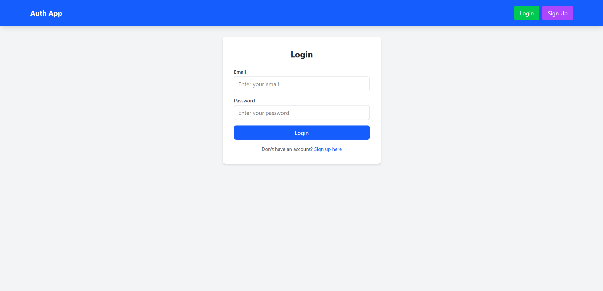
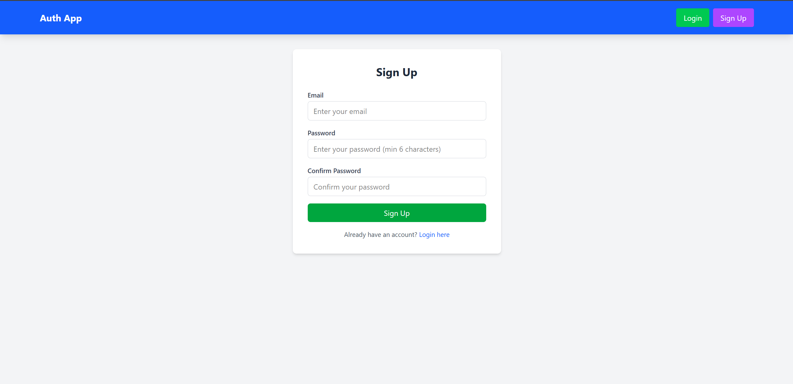
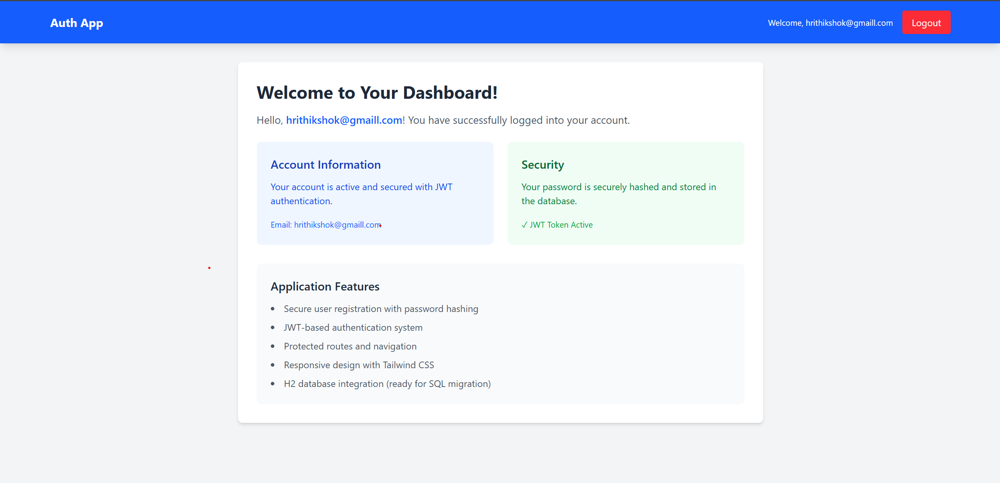

# 🎨 Frontend - React Authentication App

Modern React application with authentication, built using Vite and styled with Tailwind CSS.

## 🛠️ Technologies

- React
- Vite
- JavaScript (ES6+)
- Tailwind CSS
- React Router DOM
- Axios for API calls

## 🚀 Getting Started

### Prerequisites
- Node.js 16+
- npm or yarn

### Setup

1. **Install Dependencies**
```bash
npm install
```

2. **Environment Setup**
Create `.env` file:
```env
VITE_API_URL=http://localhost:8080
```

3. **Start Development Server**
```bash
npm run dev
```

Application runs on: `http://localhost:5173`

## 🏗️ Project Structure

```
src/
├── components/
│   ├── LoginForm.jsx
│   ├── SignupForm.jsx
│   └── Navbar.jsx
├── pages/
│   ├── Login.jsx
│   ├── Signup.jsx
│   └── Dashboard.jsx
├── services/
│   └── authService.js
├── utils/
│   └── auth.js
├── App.jsx
├── main.jsx
└── index.css
```

## 🎯 Features

- **Authentication Forms**: Login and signup with validation
- **Protected Routes**: Dashboard accessible only after login
- **JWT Token Management**: Automatic token storage and retrieval
- **Responsive Design**: Works on all devices
- **Error Handling**: User-friendly error messages
- **Loading States**: Visual feedback during API calls

## 🔧 Available Scripts

- `npm run dev` - Start development server
- `npm run build` - Build for production
- `npm run preview` - Preview production build
- `npm run lint` - Run ESLint

## 🎨 Styling

Using Tailwind CSS for utility-first styling:
- Responsive design
- Custom color scheme
- Modern UI components


### Login Page


### Signup Page


### Dashboard

